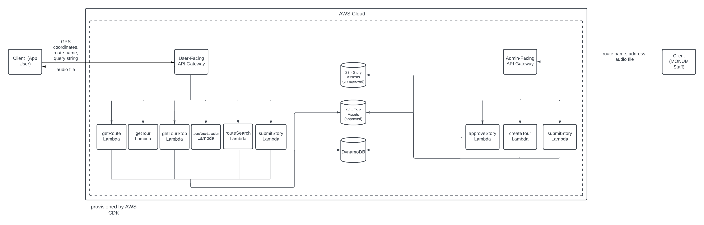

# history-tour-server

Backend APIs and AWS infrastructure for the T Tours application.

---

## T Tours

T Tours is an audio tour application that highlights sites visible from MBTA's (Massachusetts Bay Transportation Authority) public transportation routes. Each tour consists of a mixture of crowd-sourced audio clips produced by Bostonians and MONUM staff members. As the user moves along the route, the audio will automatically play based on their location. This immersive experience is enhanced with historical images, the address, and an audio transcription.

## About

`history-tour-server` is used to maintain the backend APIs and the infrastructure stack for the T Tours application.

## How It Works

This project uses **AWS API Gateway**, **AWS Lambda**, **AWS S3**, and **AWS DynamoDB** to implement a serverless backend architecture in order to reduce maintenance overhead and make it as low-cost as possible. **API Gateway** provides the HTTP endpoint, and **AWS Lamda** handles requests to that endpoint. 

**AWS Lambda** provides an API that enables access to the audio tour and route data based on the user’s location. Lambda uses **AWS S3** to store audio tour images and audio files and **AWS DynamoDB** to store tour metadata.

## Using this Repository

1. [Setup an AWS account](https://docs.aws.amazon.com/accounts/latest/reference/welcome-first-time-user.html) if you don't already have one
2. Clone this repository by running `git clone https://github.com/monum/history-tour-server.git`
3. [Install the AWS CDK](https://docs.aws.amazon.com/cdk/v2/guide/getting_started.html) for typescript by running `npm install aws-cdk-lib`
4. Run `cdk deploy` from the root of this repository. **AWS CDK** outputs the API endpoint when successfully called
5. Refer to the data types section of the [design doc](docs/DESIGN.md) to add valid entries to DynamoDB and S3
6. Use the API endpoint from Step 4 to make requests

## Future Work
* Implement future API to add support for multi-tour routes and an admin portal
* Create web app for the admin portal
* Create a mobile app that uses this backend

## License 
#### MIT License
