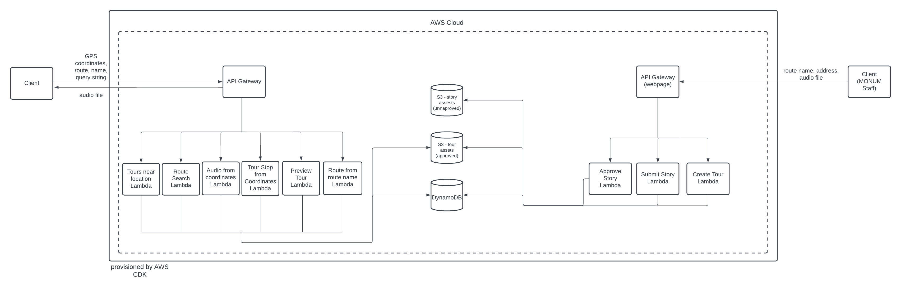

## Motivation
The Massachusetts Bay Transit Authority (MBTA) is the public transit system serving Greater Boston and its surrounding areas. In March 2020, due to the COVID-19 pandemic, ridership plummeted and still has not returned to pre-pandemic levels. In February 2023, Chief Financial Officer Mary Ann O'Hara told the MBTA Board of Directors, "Fare revenue is now supporting less than one-quarter of operating expenses today." 

In fiscal 2024, the T (MBTA) projects that ratio [will be only 18.7% compared to 43% pre-pandemic](https://www.nbcboston.com/news/local/t-towns-fear-service-levels-will-never-recover-from-pandemic-forcing-higher-fares/3048664/), putting pressure on the government to offer more subsidies or the agency to either slash costs or raise fares.

According to the MBTA Advisory Board, "Fare increases reduce ridership, and the MBTA's mission must be to attract riders right now." 

Therefore, the T needs other ways to increase ridership. 

## Requirements

We will raise ridership by creating a new mobile app that will satisfy the following sets of requirements:

### User Experience 
* A set of audio tours in partnership with the MBTA
* Accessible via a free mobile application – user downloads the app for free
* There will be at least one tour per route.
* Each tour would focus on sites visible from the windows or within walking distance from the bus stops.
* The content of the tours would be a mixture of crowd-sourced audio clips from Bostonians and clips produced by a MONUM staff member.
* A MONUM staffer will fact-check crowd-sourced content.
* Audio is accompanied by a visual, an address, and transcription
* A MONUM staffer will rotate the clips on the first day of each month.

### Frontend  
* Users can search for different routes.
* Home page displays tours near you
* Audio begins to play when a user enters one of the locations defined in the tour. 
* A photo will appear along with the audio, accompanied by a brief text description and information about the location and audio author. 
* Users have access to a complete audio player. 
* When the user hits pause, the audio pauses
* When the user hits play:
    * If the user has not finished the current audio, it ends the current audio despite the location.
    * If the user completes the last audio, it plays the next available audio based on location.
* The user can turn autoplay on or off by pressing a button. When autoplay is enabled, the following happens:
  * If the user is not playing any audio and they enter the “start zone” for an audio file, that audio will start playing.
  * If they are playing audio and they enter the start zone for a different audio file, that audio will not start playing until the current audio is complete.
* Users can view a list of all stories associated with the tour (preview route).
* Users can view a zoomable map. The map shows their location and the points along the route, connected by a thick line.
* Users are given the option to upload stories and provide:
  * Name
  * Audio
  * Images
  * Site address
  * Email
* A transcription is available for each audio file.
* MONUM staff member should be able to:
  * Upload new content
  * Approve content 
  * Create new tours

### Backend 
* Store audio files and images
* Make approved content accessible and unapproved content non-accessible
* Retrieve audio files, associated images, and metadata based on GPS coordinates
* Enable search for a route
* Retrieve tours near a GPS location
* Retrieve data of all tour stops on a given route

## High-Level Solution

This mobile application can satisfy the requirements by providing bus riders with fact-checked stories from local Bostonians. The application will automatically play audio that syncs with landmarks visible from the rider's current position. Users can submit new stories, which will be reviewed by MONUM staff and either added to a tour or rejected. The stories will be stored on the backend.

This is a POC (Proof of Concept) of this app. 

### Web App vs. Mobile App

A mobile app provides a better user experience:
 * Users access the app by tapping on an easy-to-remember icon versus having to remember a URL
 * Users can access the audio content offline

Mobile apps support both iOS and Android separately, which adds development time. The benefits outweigh this extra expense. 

### Serverless vs. Monolith

This project uses AWS API Gateway, AWS Lambda, AWS S3, and AWS DynamoDB to implement a serverless backend architecture. Alternatively, we could use EC2 with S3 and DynamoDB. Serverless has a number of advantages:

* Lambda will only execute when we need it to so that we don't have to pay for EC2 servers to sit idle; this makes serverless cheaper.
* Serverless architecture is kept up-to-date by AWS for us.
* * This means we have no downtime from kernel updates and expend no effort in software updates and version management.
* EC2 instances can crash, and we have to spend more development time to handle potential crashes. Serverless does not have this problem. 

### NoSQL vs. SQL

The data is easily modeled through a JSON structure, which is natively supported by a NoSQL database.  

## API Design - MVP

### Descriptions

* Route - the path defined by MBTA
  * Each bus route has exactly one tour
* Tour - a collection of locations and their associated audio; a mapping from location to audio
* All byte arrays will be passed to the frontend as S3 presigned URLs

### Data Types
```
GpsCoordinate: (x: float, y: float)

Route: {
  routeName: string
  tourStops: Array<TourStop>
  direction: string
}

TourStop: {
  siteName: string
  description: string
  author: string
  audioFile: Array<Byte>
  images: Array<Array<Byte>>
  siteAddress: string
  gpsCoordinate: GpsCoordinate
}
```

### Methods
* `getRoute(routeName: string): Route`
    * returns the route that has the name `routeName`
    * example: `https://<your-api-endpoint>/get-route?routeName=44`
* `getTour(routeName:string):Array<TourStop>`
    * returns a list of tour stops on the route with name `routeName`
    *  example: `https://<your-api-endpoint>/get-route?routeName=44`
* `getTourStop(routeName:string, location: GpsCoordinate): TourStop`
    * returns the tour stop on route with name `routeName` and with the shortest distance between the tour stop's `gpsCoordinate` and `location`
    *  example: `https://<your-api-endpoint>/get-tour-stop?routeName=44&latitude=42.331176&longitude=-71.091218`
* `toursNearLocation(location: GpsCoordinate): Array<Route>`
    * returns the top three closest routes to `location`, where the distance to the route is the distance to the route's closest tour stop
    * example: `https://<your-api-endpoint>/tours-near-location?latitude=42.331176&longitude=-71.091218`
* `routeSearch(query: string): Array<Route>`
    * returns all routes whose `routeName`s contain `query`
    * example: `https://<your-api-endpoint>/route-search?query=44`

## API Design - Future

### Descriptions

* Route - the path defined by MBTA
  * Each bus route has at least one tour
* Tour - a collection of locations and their associated audio; a mapping from location to audio
* All byte arrays will be passed to the frontend as S3 presigned URLs

### Data Types
```
GpsCoordinate: (x: float, y: float)

Route: {
  routeName: string
  tours: Array<Tour>
  direction: string
}

Tour: {
  tourName: string
  tourStops: Array<TourStop>
}

TourStop: {
  storyId: string
  siteName: string
  description: string
  author: string
  audioFile: Array<Byte>
  images: Array<Array<Byte>>
  siteAddress: string
  gpsCoordinate: GpsCoordinate
}

// UserStory is converted to TourStop once it's approved and siteAddress is converted to gpsCoordinate
UserStory: {
  storyId: string
  name: string
  email: string
  audioFile: Array<Byte>
  images: Array< Array<Byte>>
  siteName: string
  siteAddress: string
}
```

### Methods

`submitStory(userStory: UserStory): void`
* adds story to unapproved stories table

#### User-Facing 
* `getRoute(routeName: string): Route`
    * returns the route that has the name `routeName`
    * example: `https://<your-api-endpoint>/get-route?routeName=44`
* `getTour(routeName:string):Array<TourStop>`
    * returns a list of tour stops on the route with name `routeName`
    *  example: `https://<your-api-endpoint>/get-route?routeName=44`
* `getTourStop(routeName:string, location: GpsCoordinate): TourStop`
    * returns the tour stop on route with name `routeName` and with the shortest distance between the tour stop's `gpsCoordinate` and `location`
    *  example: `https://<your-api-endpoint>/get-tour-stop?routeName=44&latitude=42.331176&longitude=-71.091218`
* `toursNearLocation(location: GpsCoordinate): Array<Route>`
    * returns the top three closest routes to `location`, where the distance to the route is the distance to the route's closest tour stop
    * example: `https://<your-api-endpoint>/tours-near-location?latitude=42.331176&longitude=-71.091218`
* `routeSearch(query: string): Array<Route>`
    * returns all routes whose `routeName`s contain `query`
    * example: `https://<your-api-endpoint>/route-search?query=44`

#### Admin-Facing 
* `approveStory(storyName:string): void`
    * adds story to approved stories table and removes story from unapproved stories table
* `createTour(routeName: string, tourName: string, userStories: Array<UserStory>): void)`
    * creates a tour with name `tourName` and tour stops from `userStories` and adds that tour to the route in the route table with name `routeName`

## Architecture



### Components

* `Client (App User)` - End user's app
* `User-Facing API Gateway` - provides API endpoints for `getRoute`, `getTour`, `getTourStop`, `toursNearLocation`, `routeSearch`, `submitStory`
* `Admin-Facing API Gateway` - provides API endpoints for `approveStory`, `createTour`, and `submitStory`
* `Client (MONUM staff)` - admin portal user

#### User-Facing Lambda Functions

* `getRoute` - implements `getRoute`
* `getTour` - implements `getTour`
* `getTourStop` - implements `getTourStop`
* `toursNearLocation` - implements `toursNearLocation`
* `routeSearch` - implements `routeSearch`
* `submitStory` - implements `submitStory`

#### Storage

* `S3 - Story Assets (Unapproved)` - S3 Bucket that holds images and audio associated with unapproved `UserStory`s
* `S3 - Tour Assets (Approved)` - S3 Bucket that holds images and audio associated with approved `UserStory`s
* `DynamoDB`
  * `Route Table` - holds all `Route`s available to end users
  * `Unapproved User Story Table` - holds `UserStory`s that have not been approved
  * `Approved User Story Table` - holds `UserStory`s that have been approved

#### Admin-Facing Lambda Functions

* `approveStory` - implements `approveStory`
* `createTour` - implements `createTour`
* `submitStory` - implements `submitStory`

## Future Work

* Implement future API to add support for multi-tour routes and an admin portal
* Create web app for the admin portal
* Create a mobile app that uses this backend
